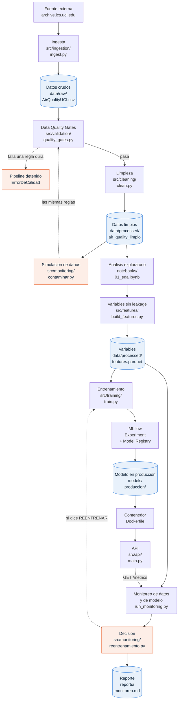

# Pronóstico de benceno a 24 horas

Proyecto final de MLOps — **Grupo #8**

Un sistema completo que va desde bajar los datos crudos hasta servir un pronóstico por una API dentro de un contenedor, con validación de calidad, registro de experimentos, pruebas automáticas y monitoreo de drift.

Todo lo que está escrito en este archivo se puede reproducir con los comandos que aparecen aquí.

---

## 1. Business Problem

Queremos **pronosticar la concentración de benceno en el aire con 24 horas de anticipación**.

El benceno es un compuesto que sale principalmente del tráfico. Está clasificado como cancerígeno y no existe un nivel por debajo del cual sea seguro respirarlo, así que la exposición hay que reducirla todo lo posible.

Saberlo con un día de antelación sirve para algo concreto:

- Un municipio puede avisar a la población y restringir el tráfico antes de que ocurra el pico, no después.
- Un hospital o una escuela puede recomendarle a la gente sensible —niños con asma, personas mayores— que se quede adentro ese día.
- Quien opera la red de sensores puede saber si mañana va a hacer falta atención especial.

**Por qué 24 horas y no una:** con una hora de aviso no se puede organizar nada. Un día alcanza para comunicar y actuar. También es lo que hace el problema difícil de verdad, y por eso obliga a ser estrictas con el leakage: a la hora de hoy no podemos usar ningún dato de las próximas 23 horas, porque en la vida real todavía no habrían ocurrido.

**Qué medimos.** La métrica principal es el **MAE en µg/m³**, porque es la que se entiende sin traducción: "en promedio nos equivocamos por tantos microgramos". El RMSE lo reportamos al lado porque castiga más los errores grandes, que son los que importan en un pico de contaminación.

**Por qué no usamos el MAPE como métrica principal:** cuando el benceno baja mucho —los meses fríos— cualquier error chiquito se convierte en un porcentaje enorme. En nuestros resultados el lote 2 tiene el MAPE más alto (78.7%) pero **no** el peor MAE. El porcentaje engaña; el MAE no.

**Qué sería un buen resultado.** Nos pusimos como piso ganarle por lo menos un 10% al modelo tonto de repetir el valor de ayer a la misma hora, y como techo un MAE de 5 µg/m³. Un pronóstico que se equivoque más que eso no sirve para tomar decisiones.

---

## 2. Dataset

**Air Quality** del repositorio de la Universidad de California en Irvine.

| | |
|---|---|
| Fuente | https://archive.ics.uci.edu/dataset/360/air+quality |
| Descarga directa | https://archive.ics.uci.edu/static/public/360/air+quality.zip |
| DOI | 10.24432/C59K5F |
| Filas | 9 357 horas seguidas |
| Periodo | del 2004-03-10 18:00 al 2005-04-04 14:00 |
| Columnas | 15 |
| Lugar | una ciudad del norte de Italia |

### Lo que trae

| Columna | Qué es |
|---|---|
| `Date`, `Time` | fecha y hora de la medición |
| `CO(GT)`, `NMHC(GT)`, `NOx(GT)`, `NO2(GT)` | mediciones del analizador certificado de referencia |
| `C6H6(GT)` | **benceno — es lo que queremos pronosticar** |
| `PT08.S1(CO)` … `PT08.S5(O3)` | cinco sensores de estado sólido |
| `T`, `RH`, `AH` | temperatura, humedad relativa y humedad absoluta |

### Tres cosas que descubrimos leyendo los datos y que cambiaron el proyecto

**El archivo no es fácil de leer.** Usa punto y coma como separador y **coma como decimal**, y trae dos columnas vacías al final más filas vacías al fondo. Si se lee con la configuración por defecto de pandas, todos los números entran como texto. Está resuelto en `src/ingestion/ingest.py`.

**Los faltantes vienen escritos como `-200`, no como celdas vacías.** Si no se convierten a nulo antes de calcular nada, los promedios salen negativos y todo el análisis queda mal.

**Los huecos no están sueltos: son apagones.** Los 366 faltantes del benceno no están repartidos al azar; son **16 periodos en que el equipo dejó de medir**, el más largo de **76 horas seguidas**. Eso decidió cómo limpiamos: rellenar por interpolación solo los huecos de hasta 3 horas y dejar los largos como nulos. Rellenar tres días seguidos sería inventar datos.

También descartamos la columna `NMHC(GT)` completa: el **90.23%** de sus valores son `-200`. No hay nada que rescatar ahí.

Un detalle sobre la fuente: la página de UCI dice que el periodo es de marzo de 2004 a febrero de 2005, pero el archivo llega hasta **abril de 2005**. Son casi 13 meses, no 12. Nos guiamos por el archivo.

### Cómo partimos los datos

Es una serie de tiempo, así que **los cortes son por fecha y nunca al azar**. Partir al azar dejaría horas del futuro dentro del entrenamiento.

| Tramo | Desde | Hasta | Filas | Para qué |
|---|---|---|---|---|
| `train` | 2004-03-16 18:00 | 2004-08-15 23:00 | 3 332 | entrenar |
| `validation` | 2004-08-16 00:00 | 2004-09-30 23:00 | 887 | escoger el modelo |
| `batch1` | 2004-10-01 00:00 | 2004-11-30 23:00 | 1 464 | "producción" |
| `batch2` | 2004-12-01 00:00 | 2005-01-31 23:00 | 1 058 | "producción" |
| `batch3` | 2005-02-01 00:00 | 2005-04-03 14:00 | 1 270 | "producción" |
| | | | **8 011** | |

`train` + `validation` = **4 219 filas** es lo que llamamos **REFERENCE**: todo lo que el modelo llegó a conocer. Los tres lotes hacen de datos de producción que llegan después en el tiempo.

**De 9 357 horas quedan 8 011.** Se pierden en tres partes, y ninguna es un error:

- **144 al principio.** El rezago más largo es de 168 horas y el horizonte es de 24, así que la primera fila que se puede armar necesita 144 horas de historia previa.
- **24 al final.** Para la última hora del archivo no existe todavía el valor real de 24 horas después, así que no hay nada contra qué comparar.
- **1 178 en el medio.** Son las filas donde alguno de los rezagos cae dentro de un apagón del equipo. Preferimos perderlas antes que rellenar con un número inventado.

---

## 3. Architecture

Cada caja del diagrama corresponde a un archivo real de este repositorio. El nombre del archivo va escrito dentro de la caja.


La imagen se genera con:

```bash
python scripts/diagrama.py
```

Deja dos archivos: `12_arquitectura.png`, que es el de arriba, y `12_arquitectura_lamina.png`, el mismo sin el título, que es el que va en la presentación porque allí la lámina ya lleva el suyo.

Las tres flechas que vale la pena mirar dos veces:

- **Data Quality Gates → Pipeline detenido**, en naranja punteado. Si falla una regla dura, el pipeline se detiene ahí y no sigue. No es un aviso que se pueda ignorar.
- **Simulación de daños → Data Quality Gates.** La simulación no usa reglas propias: le pasa el lote roto a **las mismas** reglas que usa el pipeline de verdad. Si usara otras, no probaría nada.
- **Decisión → Entrenamiento**, también punteada. Es el ciclo cerrado: cuando la decisión dice REENTRENAR, se vuelve al entrenamiento. Va punteada porque el disparo lo autorizamos nosotras, no es automático (explicado en la sección 11).

<details>
<summary>El mismo diagrama escrito en Mermaid, por si se quiere editar</summary>



</details>

---

## 4. Repository Structure

```
AirQuality/
├── data/
│   ├── raw/                     datos como vinieron, no se tocan nunca
│   ├── interim/                 leídos y con los -200 pasados a nulo
│   └── processed/               limpios y con las variables construidas
├── logs/
│   └── pipeline.log             todo lo que hizo cada corrida
├── models/
│   ├── produccion/              el modelo exportado que usa Docker
│   └── produccion_info.json     ficha del modelo en producción
├── notebooks/
│   └── 01_eda.ipynb             análisis exploratorio con las decisiones
├── presentacion/
│   ├── grupo8_mlops.pptx        la presentación para proyectar
│   ├── presentacion.md          la misma, en texto y con las notas
│   ├── guion_demo.md            el guion de la demostración en vivo
│   └── armar_presentacion.js    genera el .pptx
├── reports/
│   ├── diagnostico_calidad.md   diagnóstico de los datos en 9 puntos
│   ├── informe_tecnico.md       el informe técnico del proyecto
│   ├── monitoreo.md             reporte de drift y desempeño
│   ├── monitoreo.json           lo mismo en formato para máquinas
│   └── figuras/                 las 12 gráficas y el diagrama
├── scripts/
│   ├── probar_api.py            prueba la API con datos reales
│   └── diagrama.py              genera la imagen del diagrama
├── src/
│   ├── config.py                TODOS los umbrales, rutas y fechas
│   ├── logger.py                el log a consola y a archivo
│   ├── ingestion/ingest.py      descarga y lectura del csv
│   ├── validation/
│   │   ├── quality_gates.py     las 9 reglas de calidad
│   │   └── diagnose.py          el diagnóstico escrito
│   ├── cleaning/clean.py        limpieza con las decisiones justificadas
│   ├── eda/plots.py             las gráficas del análisis
│   ├── features/build_features.py   variables, con corte anti-leakage
│   ├── training/
│   │   ├── models.py            el catálogo de 4 modelos
│   │   ├── evaluate.py          métricas y gráficas de evaluación
│   │   └── train.py             entrena, compara, escoge y registra
│   ├── api/
│   │   ├── main.py              los 6 endpoints
│   │   ├── modelo.py            carga del modelo
│   │   ├── schemas.py           validación de entrada y salida
│   │   └── metricas.py          contadores de latencia y errores
│   └── monitoring/
│       ├── drift.py             PSI, KS, Wasserstein, Jensen-Shannon
│       ├── model_metrics.py     MAE y RMSE por lote y por semana
│       ├── contaminar.py        la simulación de daños
│       ├── reentrenamiento.py   la decisión de reentrenar
│       ├── plots.py             las gráficas del monitoreo
│       └── run_monitoring.py    corre todo y escribe el reporte
├── tests/
│   ├── test_features.py         19 pruebas
│   ├── test_api.py              17 pruebas
│   └── test_monitoring.py       20 pruebas
├── Dockerfile
├── requirements.txt             para desarrollar
├── requirements-api.txt         solo lo que necesita la API
└── README.md
```

**Dos decisiones de estructura que sostenemos:**

**Todo lo configurable vive en `src/config.py`.** Ningún umbral, ninguna fecha y ninguna ruta está escrita a mano dentro de otro archivo. Si mañana el horizonte pasa de 24 a 48 horas, se cambia una línea y el proyecto entero se acomoda, incluida la regla que corta por leakage.

**Las carpetas `raw` → `interim` → `processed` no se mezclan.** `raw` no se toca nunca; si algo sale mal siempre se puede volver al punto de partida sin bajar los datos otra vez.

---

## 5. Installation

Hace falta **Python 3.12**. Con Python 3.14 varias de las librerías fijadas todavía no tienen versión compilada y la instalación falla.

```bash
git clone https://github.com/Mayarling/AirQuality.git
cd AirQuality
```

**Windows (PowerShell):**

```powershell
py -3.12 -m venv .venv
.\.venv\Scripts\Activate.ps1
python -m pip install --upgrade pip
pip install -r requirements.txt
```

Si PowerShell no deja activar el entorno, hay que darle permiso una sola vez:

```powershell
Set-ExecutionPolicy -Scope CurrentUser -ExecutionPolicy RemoteSigned
```

**Linux o macOS:**

```bash
python3.12 -m venv .venv
source .venv/bin/activate
pip install --upgrade pip
pip install -r requirements.txt
```

Para comprobar que quedó bien:

```bash
python -m pytest tests/ -v
```

Tienen que pasar **56 pruebas**.

### Todo el pipeline de una vez

```bash
python -m src.ingestion.ingest
python -m src.validation.diagnose
python -m src.cleaning.clean
python -m src.features.build_features
python -m src.training.train
python -m src.monitoring.run_monitoring
```

---

## 6. Data Ingestion

```bash
python -m src.ingestion.ingest            # usa lo ya descargado si existe
python -m src.ingestion.ingest --force    # vuelve a bajar el archivo
```

Qué hace, en orden:

1. Baja el zip de UCI. Si no hay internet, usa la copia de `data/raw` y lo dice en el log.
2. Lee el csv con `sep=';'` y `decimal=','`, y quita las dos columnas vacías del final y las filas vacías del fondo.
3. Junta `Date` y `Time` en una sola columna `datetime`.
4. Convierte los `-200` en nulos de verdad.
5. Calcula el **md5 del archivo** y lo guarda como `data_version`. Ese mismo código queda después registrado en MLflow, así que de cualquier modelo entrenado se puede saber con qué archivo exacto se entrenó.
6. Guarda `data/interim/air_quality_interim.parquet`.

Después de la ingesta corren las **9 reglas de calidad**:

```bash
python -m src.validation.diagnose
```

| Código | Regla | Tipo |
|---|---|---|
| R01 | el esquema de columnas es el esperado | dura |
| R02 | llega la cantidad mínima de filas | dura |
| R03 | no hay marcas de tiempo repetidas | dura |
| R04 | la serie horaria es continua | blanda |
| R05 | los valores están dentro de rangos físicos posibles | dura |
| R06 | el target no pasa del 10% de huecos | blanda |
| R07 | no hay más de 1% de filas duplicadas | dura |
| R08 | ninguna columna es constante | blanda |
| R09 | los tipos de dato son numéricos donde deben serlo | dura |

**Dura** significa que el pipeline se detiene. **Blanda** significa que queda un aviso en el log y el proceso sigue.

La diferencia importa: que falten unas horas sueltas (R04) es normal en un equipo real y no justifica botar toda la corrida. Que aparezca una columna que no existía (R01) sí, porque a partir de ahí nada de lo que se calcule significa lo mismo.

Las reglas corren **dos veces**: a la entrada, sobre los datos crudos, y a la salida, sobre los datos ya limpios. La segunda pasada es la que comprueba que la limpieza no rompió nada.

### Limpieza

```bash
python -m src.cleaning.clean
```

Tres decisiones, y por qué:

| Decisión | Por qué |
|---|---|
| Se descarta `NMHC(GT)` | el 90.23% de sus valores son `-200`. Rellenar eso sería inventar el 90% de una columna. |
| Se interpolan solo los huecos de **hasta 3 horas seguidas** | los huecos son apagones de hasta 76 horas. Se rellena el hueco completo o no se rellena nada: no usamos `limit=3` de pandas, porque eso rellenaría las primeras 3 horas de un apagón de 76 y dejaría un salto falso justo ahí. |
| **No se borra ninguna fila** | borrar filas correría las horas y los rezagos dejarían de apuntar a donde deben. |

Queda una columna extra, `imputado`, que marca con un 1 los valores que fueron rellenados. Así siempre se puede distinguir un dato medido de uno calculado.

---

## 7. Training

```bash
python -m src.features.build_features
python -m src.training.train
```

### Las 18 variables

| Grupo | Variables |
|---|---|
| Rezagos del benceno | `benceno_lag24`, `benceno_lag25`, `benceno_lag48`, `benceno_lag168` |
| Resúmenes móviles | `benceno_media3h`, `benceno_media24h`, `benceno_tendencia` |
| Sensores rezagados | `PT08.S1(CO)_lag24`, `PT08.S2(NMHC)_lag24`, `PT08.S5(O3)_lag24` |
| Ambientales rezagadas | `T_lag24`, `RH_lag24`, `AH_lag24` |
| Calendario | `hora_seno`, `hora_coseno`, `dia_seno`, `dia_coseno`, `es_fin_de_semana` |

**Por qué el rezago más corto es de 24 horas y no de 1.** Los rezagos están medidos **desde la hora que queremos predecir**, no desde ahora. Si queremos predecir la hora `t+24`, el dato más reciente que existe es el de la hora `t`, que respecto de `t+24` es un rezago de 24. Un rezago de 1 hora significaría usar el dato de `t+23`, que todavía no ha ocurrido.

Esto no queda solo escrito en un comentario: está programado. `src/features/build_features.py` levanta un error y **detiene el proceso** si alguien pide un rezago menor que el horizonte:

```python
def _validar_rezago(rezago, horizonte):
    if rezago < horizonte:
        raise ErrorDeLeakage(...)
```

Las variables de calendario sí se calculan sobre la hora que se quiere predecir, y eso no es leakage: qué día de la semana va a ser mañana se sabe hoy.

**Por qué `PT08.S2(NMHC)` solo entra rezagado.** Ese sensor correlaciona **0.982** con el benceno. Usarlo en el mismo instante daría un modelo con métricas espectaculares y completamente inútil, porque en la vida real esa lectura no existe hasta que llega la hora.

**El target va en logaritmo.** El benceno tiene sesgo **1.361** por una cola larga de picos; con logaritmo baja a **−0.234**. Entrenamos en log y devolvemos todas las métricas en µg/m³, que es la escala que se entiende.

### Los cuatro modelos

| Modelo | Para qué está |
|---|---|
| `baseline_persistencia` | repetir el valor de ayer a la misma hora. Es el piso: si un modelo no le gana a esto, no sirve. |
| `ridge` | regresión lineal con regularización. Rápida y difícil de sobreajustar. |
| `random_forest` | árboles en paralelo. Capta relaciones no lineales. |
| `gradient_boosting` | árboles en secuencia, cada uno corrige al anterior. |

La búsqueda de hiperparámetros usa **`TimeSeriesSplit`**, que respeta el orden del tiempo. Una validación cruzada normal entrenaría con datos de agosto para validar en julio.

### Cómo se escoge el ganador

No gana "el que dio mejor". Para ser candidato hay que cumplir **las tres condiciones**, y entre los que cumplen gana el de menor MAE en validación:

1. Ganarle al baseline por al menos **10%** de MAE.
2. Que el MAE de validación no sea más de **60%** peor que el de entrenamiento (si lo es, se aprendió el ruido).
3. Que el MAE de validación no pase de **5.0 µg/m³**.

Y el criterio funcionó de verdad: **`random_forest` quedó rechazado** aunque su MAE era mejor que el de `ridge`, porque se degradaba un **68.4%** de entrenamiento a validación. Estaba sobreajustado.

---

## 8. MLflow

```bash
mlflow ui
```

Y se abre `http://localhost:5000`.

Experimento: **`air-quality-benceno-24h`**. Modelo registrado: **`grupo8-benceno-24h`**.

### Qué queda guardado en cada corrida

| | Cuántos | Ejemplos |
|---|---|---|
| Parámetros | 15 | algoritmo, horizonte, semilla, fechas de corte, `data_version` (el md5 del archivo) |
| Métricas | 42 | MAE, RMSE, MAPE, R² y sesgo, en entrenamiento y en validación |
| Artefactos | 5 | gráfica de residuos, real contra predicho, la serie superpuesta, importancia de variables y la tabla comparativa |
| Modelo | 1 | el pipeline completo, con su firma de entrada y salida |

Guardar el **md5 del archivo** como parámetro es lo que hace que cualquier corrida sea rastreable hasta el dato exacto con el que se entrenó.

### El ciclo de vida del modelo

Usamos **alias**, no *stages*. Los stages quedaron obsoletos en MLflow y los alias hacen lo mismo:

```
Experiment  →  candidato  →  produccion
```

`src/training/train.py` registra la versión nueva, le pone el alias `candidato`, comprueba que cumpla los tres criterios y solo entonces le mueve el alias `produccion`.

### Por qué además exportamos el modelo aparte

MLflow guarda dentro de `mlruns/` las **rutas absolutas de la máquina donde se entrenó** (`C:\Users\...`). Dentro de un contenedor esas rutas no existen y el modelo no carga.

Por eso el entrenamiento deja una copia suelta en `models/produccion/` con su ficha en `models/produccion_info.json`. Esa copia es la que va en la imagen de Docker, y eso permitió sacar MLflow entero de la imagen.

`mlruns/` **no se sube al repositorio**: se regenera corriendo el entrenamiento.

---

## 9. Docker

```bash
docker build -t grupo8-mlops .
docker run -p 8000:8000 grupo8-mlops
```

Antes de construir hay que haber entrenado, porque la imagen copia `models/produccion`.

Para comprobar que quedó viva:

```bash
curl http://localhost:8000/health
docker ps          # la columna STATUS debe decir (healthy)
```

### Las cuatro decisiones de la imagen

**Versión fija, `python:3.12-slim`, no `latest`.** Con `latest` la imagen cambiaría sola de un día para otro y dejaría de ser reproducible.

**Los requisitos se copian antes que el código.** Docker guarda cada paso en caché. Si primero se copiara el código, cualquier cambio de una línea obligaría a reinstalar todas las librerías desde cero.

**La imagen instala `requirements-api.txt`, no `requirements.txt`.** La API no necesita MLflow, matplotlib ni statsmodels. Lo medimos construyendo las dos:

| Imagen | Tamaño |
|---|---|
| Con `requirements.txt` completo | **1.33 GB** |
| Con `requirements-api.txt` | **865 MB** |

Son **465 MB menos, cerca de un 35%**.

**Corre con un usuario sin privilegios.** Por defecto un contenedor corre como root. Creamos el usuario `servicio` para que, si alguien lograra entrar por la API, no tuviera permisos de administrador adentro.

Además hay un **HEALTHCHECK** que le pega a `/health` cada 30 segundos. Si la API deja de responder, Docker marca el contenedor como *unhealthy* y se ve en `docker ps`.

---

## 10. API

Hecha con FastAPI. Para levantarla sin Docker:

```bash
uvicorn src.api.main:app --reload
```

Documentación interactiva en `http://localhost:8000/docs`.

| Método | Ruta | Qué hace |
|---|---|---|
| GET | `/` | información del servicio |
| GET | `/health` | si está vivo y si el modelo cargó |
| GET | `/model-info` | qué modelo está sirviendo, qué versión y con qué variables |
| GET | `/metrics` | latencia, throughput, tasa de error y disponibilidad |
| POST | `/predict` | un pronóstico |
| POST | `/predict/batch` | varios pronósticos de una vez |

Para probarla con datos de verdad:

```bash
python scripts/probar_api.py
```

### Cómo se pide un pronóstico

La entrada **no son las 18 variables ya calculadas**, sino las **últimas 145 horas de mediciones**. La API construye las variables por dentro, llamando a **la misma función que usó el entrenamiento**.

Es a propósito: si la API armara las variables por su cuenta, cualquier diferencia mínima con el entrenamiento pasaría desapercibida y el modelo estaría recibiendo algo distinto de lo que aprendió. Es uno de los errores más comunes en producción y se llama *training-serving skew*.

Las 145 horas salen de la variable más exigente: `benceno_lag168` necesita 168 horas de historia, y con el horizonte de 24 el desplazamiento efectivo es de 144. Más la hora actual, 145.

Las entradas se validan con Pydantic. Si faltan horas, si sobran o si un valor está fuera de rango físico, la API responde con un error claro y **no inventa un pronóstico**.

### Métricas operativas

Un middleware le toma el tiempo a **cada** petición y le agrega la cabecera `X-Latencia-ms`. En `GET /metrics` se ven acumuladas: peticiones totales, latencia promedio y percentil 95, throughput, tasa de error y disponibilidad.

Solo los errores 5xx cuentan como falla del servicio. Un 422 —que alguien mandó datos mal— no es un problema de la API; es la API haciendo su trabajo.

---

## 11. Monitoring

```bash
python -m src.monitoring.run_monitoring
```

Deja el reporte en `reports/monitoreo.md`, los números en `reports/monitoreo.json` y las gráficas 08 a 11 en `reports/figuras/`.

### Las tres dimensiones

| Dimensión | Qué vigila | Dónde está |
|---|---|---|
| **System** | latencia, throughput, errores, disponibilidad | `GET /metrics` y `logs/pipeline.log` |
| **Data** | que las distribuciones no cambien | `src/monitoring/drift.py` |
| **Model** | que el pronóstico siga acertando | `src/monitoring/model_metrics.py` |

### Cuatro medidas de drift, no una

| Medida | Qué mira |
|---|---|
| **PSI** | parte la variable en 10 tramos y compara los porcentajes. Es la que usamos para decidir. |
| **Kolmogorov-Smirnov** | la mayor distancia entre las curvas acumuladas. |
| **Wasserstein** | cuánto habría que mover los datos, en las unidades de la variable. |
| **Jensen-Shannon** | qué tan distintas son, de 0 a 1. |

Sobre el p-valor de Kolmogorov-Smirnov hay que tener cuidado: con miles de filas casi cualquier diferencia sale significativa. Por eso lo reportamos junto al PSI y nunca decidimos con él solo.

Los cortes del PSI (**0.10** aviso, **0.25** alerta) vienen de los modelos de riesgo crediticio. **No son leyes universales** y el propio enunciado pide no tratarlos como tales. En nuestro caso separan bien lo que vimos, y hay una comprobación que lo confirma: **las variables de calendario dan PSI cercano a cero**. Tiene que ser así, porque la distribución de horas y días de la semana no cambia de un periodo a otro. Si dieran alto, el cálculo estaría mal.

### Cuándo reentrenar

Hacen falta **las dos cosas a la vez**:

```
SI    el PSI más alto ≥ 0.25
Y     el MAE empeoró más de 25% respecto de validación
Y     el lote trae al menos 200 filas
ENTONCES  reentrenar
```

| Drift | Degradación | Decisión | Por qué |
|---|---|---|---|
| sí | sí | **REENTRENAR** | cambiaron los datos y el modelo lo sufrió |
| sí | no | **VIGILAR** | cambiaron los datos pero el modelo aguanta |
| no | sí | **REVISAR_DATOS** | algo pasa que el PSI no ve |
| no | no | **TODO_BIEN** | seguir midiendo |

**El disparo no es automático.** Cuando la decisión dice REENTRENAR queda registrado en el log y en el reporte, pero el entrenamiento lo lanzamos nosotras. Con un solo modelo y un histórico chico, un reentrenamiento automático puede reemplazar un modelo bueno por uno peor sin que nadie se entere. Preferimos que quede un ser humano en el medio.

### La simulación de problemas de calidad

```bash
python -m src.monitoring.contaminar
```

Le mete seis daños a una **copia en memoria** de un lote y se lo pasa a **las mismas** reglas de calidad del pipeline:

| Daño | Qué se hace |
|---|---|
| valores faltantes | se borra el 8% del benceno |
| filas duplicadas | se repiten 25 filas |
| valor absurdo | humedad relativa de 999% y benceno de -45 |
| tipo incorrecto | se pone el texto `"quince grados"` en la temperatura |
| categoría desconocida | se agrega una columna `pais = "UNKNOWN_NEW_COUNTRY"` |
| cambio de esquema | se borra la columna `PT08.S3(NOx)` |

Resultado:

```
Danos aplicados     : 6
Reglas que fallaron : 6 de 7
Pipeline bloqueado  : si
Dataset intacto     : si
Ciclo detecta -> bloquea -> registra: cumplido
```

El archivo original queda con **el mismo md5 antes y después**. La contaminación es solo en memoria y hay una comprobación al final que lo verifica.

**Esta simulación encontró un error real en nuestro propio código.** La regla R05, la de rangos físicos, se caía cuando le llegaba texto donde esperaba un número. Está corregida: ahora los cuenta aparte y los reporta como `valores que no son numeros`. Si no hubiéramos hecho la simulación, ese error habría aparecido en producción.

---

## 12. Results

### Los cuatro modelos en validación

| Modelo | MAE | RMSE | MAPE | R² |
|---|---|---|---|---|
| **gradient_boosting** | **2.905** | **4.430** | 33.4% | **0.648** |
| random_forest | 3.043 | 4.606 | 35.2% | 0.619 |
| ridge | 3.096 | 4.808 | 35.6% | 0.585 |
| baseline_persistencia | 4.021 | 6.070 | 53.4% | 0.338 |

MAE y RMSE en µg/m³.

### Cómo se aplicaron los criterios

```
Baseline (baseline_persistencia): MAE 4.021 ug/m3

  ridge                APROBADO  (mejora 23.0%, degradacion 8.2%)
  random_forest        RECHAZADO: se degrada 68.4% de train a validation
  gradient_boosting    APROBADO  (mejora 27.8%, degradacion 50.7%)

Gana gradient_boosting con MAE 2.905 ug/m3 en validacion
```

**Modelo en producción:** `grupo8-benceno-24h` **versión 2**, algoritmo `gradient_boosting`, con **27.8% menos error que el baseline**.

Vale la pena mirar el caso de `ridge`: se degrada solo **8.2%** de entrenamiento a validación, contra el **50.7%** del ganador. Es un modelo mucho más estable, aunque su MAE sea peor. Si esto fuera a producción de verdad y el histórico creciera, `ridge` sería un candidato serio.

### Qué variables pesan

La importancia se mide **por permutación**: se revuelve una columna al azar y se mira cuánto empeora el error. Es más lento que mirar la estructura interna del modelo, pero mide lo que el modelo de verdad usa.

| Variable | Importancia |
|---|---|
| `benceno_lag168` | 0.11016 |
| `hora_coseno` | 0.03508 |
| `PT08.S2(NMHC)_lag24` | 0.02701 |
| `dia_seno` | 0.02469 |
| `benceno_lag24` | 0.02035 |
| `hora_seno` | 0.01327 |
| `T_lag24` | 0.00632 |
| `benceno_media24h` | 0.00568 |

`benceno_lag168` —el benceno de hace una semana a la misma hora— es la variable más importante con diferencia: pesa **5.4 veces** lo que pesa `benceno_lag24`. El patrón semanal manda sobre el diario, y tiene sentido, porque el tráfico se repite por día de la semana.

Detrás vienen `hora_coseno` y `PT08.S2(NMHC)_lag24`. Que dos de las cuatro primeras sean variables de calendario dice mucho: buena parte de lo que hay que saber del benceno de mañana está en qué hora y qué día va a ser.

### El monitoreo sobre los tres lotes

| Lote | Filas | PSI máximo | MAE | Degradación | Decisión |
|---|---|---|---|---|---|
| validation | 887 | — | 2.905 | — | referencia |
| batch1 | 1 464 | 1.671 | 5.485 | **+88.8%** | REENTRENAR |
| batch2 | 1 058 | 6.175 | 4.389 | **+51.1%** | REENTRENAR |
| batch3 | 1 270 | 3.265 | 2.805 | **−3.4%** | VIGILAR |

En los tres lotes la variable que más cambia es la misma: **`T_lag24`**, la temperatura. Es el cambio de estación entre el verano con el que se entrenó y el otoño e invierno que vinieron después.

### El hallazgo principal

**El lote 3 tiene un PSI de 3.265 —un cambio enorme— y el modelo anda un 3.4% MEJOR que en validación.**

Si el disparador mirara solo el drift, habríamos reentrenado un modelo que estaba funcionando bien. Ahí está la respuesta a por qué Data Drift no es lo mismo que Model Degradation:

1. **El modelo aprendió la relación entre las variables, no sus valores.** Si aprendió que con temperatura baja hay menos benceno, un invierno frío entra dentro de lo que ya sabe, aunque la distribución de temperatura se haya movido muchísimo.
2. **El drift puede estar en variables que al modelo casi no le importan.**
3. **Y al revés también pasa:** un modelo se puede degradar sin drift ninguno, si cambia la relación entre las variables y lo que se quiere predecir. Eso se llama *concept drift* y el PSI no lo ve.

Por eso los dos monitoreos son necesarios y ninguno reemplaza al otro. El de datos avisa temprano, incluso antes de saber si el pronóstico fue bueno. El de modelo confirma si hubo daño de verdad, pero con un horizonte de 24 horas solo se puede medir un día después.

### Pruebas

```bash
python -m pytest tests/ -v
```

| Archivo | Pruebas | Qué comprueba |
|---|---|---|
| `test_features.py` | 19 | que no haya leakage, que los rezagos apunten donde deben |
| `test_api.py` | 17 | los 6 endpoints, las validaciones y los errores |
| `test_monitoring.py` | 20 | que las medidas de drift no mientan y que la decisión sea correcta |
| **Total** | **56** | |

Una prueba en particular es la que más nos importa: `test_no_reentrena_solo_por_drift` reproduce el caso del lote 3 y falla si el sistema decidiera reentrenar. Si esa prueba se pusiera en rojo, estaríamos botando modelos que funcionan.

### Lo que no hicimos

Para ser honestas sobre los límites de este trabajo:

- **Un solo lugar y un solo año.** El modelo aprendió de una ciudad del norte de Italia entre 2004 y 2005. No sirve tal cual en otra ciudad.
- **El umbral del 25% de degradación lo escogimos nosotras.** Es un punto de partida razonable, pero habría que ajustarlo viendo cuánto le cuesta al negocio un error de pronóstico.
- **No hay reentrenamiento automático**, por la razón explicada arriba.
- **El monitoreo de modelo llega tarde por diseño.** Con horizonte de 24 horas el error solo se puede medir al día siguiente.

---

## Documentación

| Documento | Qué es |
|---|---|
| `README.md` | este archivo |
| `reports/informe_tecnico.md` | el informe técnico: decisiones, resultados y límites |
| `reports/diagnostico_calidad.md` | el diagnóstico de los datos en 9 puntos |
| `reports/monitoreo.md` | el reporte de drift y desempeño |
| `presentacion/grupo8_mlops.pptx` | la presentación de la defensa |
| `presentacion/guion_demo.md` | el guion de la demostración en vivo |
| `notebooks/01_eda.ipynb` | el análisis exploratorio, con las decisiones |

---

## 13. Team

**Grupo #8**

| Integrante | Trabajo principal |
|---|---|
| **Mayarling Martínez** | ingesta, calidad y limpieza, análisis exploratorio, variables, entrenamiento, MLflow, API y Docker |
| **Nicole Chavarría** | monitoreo de datos y de modelo, simulación de problemas de calidad, lógica de reentrenamiento y pruebas del monitoreo |

Trabajamos con ramas: cada parte salió en su propia rama `feature/...`, se revisó por Pull Request contra `develop` y de ahí pasó a `main`.

```
main
 └── develop
      ├── feature/data-ingestion
      ├── feature/data-quality
      ├── feature/eda-figuras
      ├── feature/model
      ├── feature/api-docker
      └── feature/monitoring
```

---

## Comandos, todos juntos

```bash
# instalación
git clone https://github.com/Mayarling/AirQuality.git
cd AirQuality
py -3.12 -m venv .venv
.\.venv\Scripts\Activate.ps1
pip install -r requirements.txt

# pipeline completo
python -m src.ingestion.ingest
python -m src.validation.diagnose
python -m src.cleaning.clean
python -m src.features.build_features
python -m src.training.train

# experimentos
mlflow ui

# API sin contenedor
uvicorn src.api.main:app --reload

# API en contenedor
docker build -t grupo8-mlops .
docker run -p 8000:8000 grupo8-mlops

# monitoreo y simulación de daños
python -m src.monitoring.run_monitoring
python -m src.monitoring.contaminar

# pruebas
python -m pytest tests/ -v
```
