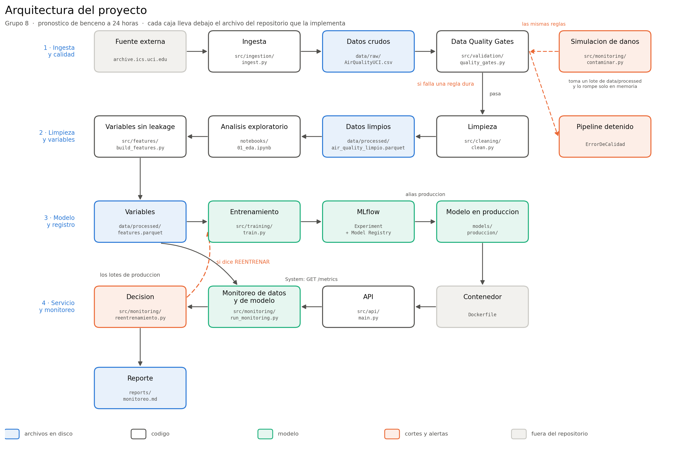
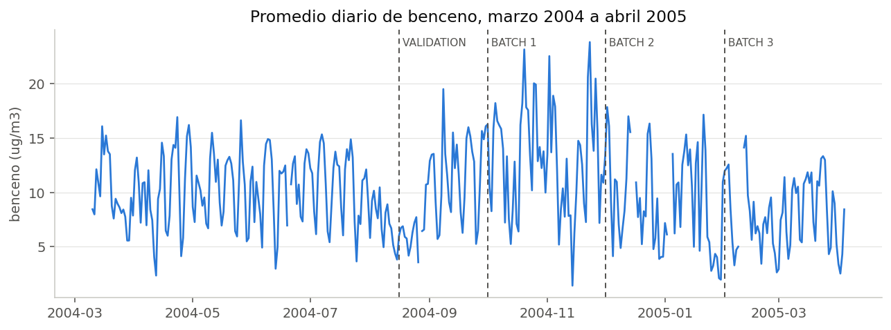

# Informe técnico

**Pronóstico de benceno a 24 horas · Grupo #8**

Mayarling Martínez y Nicole Chavarría

---

## 1. Resumen ejecutivo

Construimos un sistema completo que pronostica la concentración de benceno en el aire con 24 horas de anticipación, desde la descarga del archivo original hasta un servicio que responde por internet dentro de un contenedor, con vigilancia automática de la calidad de los datos y del desempeño del modelo.

**Lo que conseguimos:**

| | |
|---|---|
| Modelo en producción | `gradient_boosting` |
| Error promedio | **2.905 µg/m³** de MAE en validación |
| Contra el modelo tonto de repetir el valor de ayer | **27.8% menos error** |
| Pruebas automáticas | **56**, todas pasando |
| Tamaño de la imagen del servicio | **865 MB** |

**Los tres hallazgos que más nos enseñaron:**

**Uno.** Los datos faltantes del archivo no están repartidos al azar: son **16 apagones del equipo de medición**, el más largo de 76 horas seguidas. Eso cambió por completo cómo los tratamos. Rellenar un hueco de tres días con una línea recta habría sido inventar datos y el modelo habría aprendido de esa invención.

**Dos.** Que los datos cambien no significa que el modelo se haya dañado. Nuestro lote 3 de producción tiene un cambio de distribución enorme —PSI de 3.265, muy por encima del umbral de alerta— y sin embargo **el modelo acierta un 3.4% mejor que en validación**. Si el disparador de reentrenamiento mirara solo el drift, habríamos reemplazado un modelo que estaba funcionando bien.

**Tres.** Fabricar problemas a propósito encontró un error real en nuestro propio código. La regla de validación que revisa rangos físicos se caía cuando le llegaba texto donde esperaba un número. Sin la simulación, ese error habría aparecido en producción.

### El sistema de un vistazo



Cada caja del diagrama lleva debajo el archivo del repositorio que la implementa. Las dos flechas naranjas punteadas son las que más vale mirar: la de arriba a la derecha detiene el pipeline cuando falla una regla dura, y la de abajo a la izquierda lo devuelve al entrenamiento cuando la decisión dice REENTRENAR.

La imagen se genera con `python scripts/diagrama.py`.

---

## 2. El problema

### Qué se quiere resolver

El benceno es un compuesto que sale principalmente del tráfico. Está clasificado como cancerígeno y no hay un nivel por debajo del cual sea seguro respirarlo, así que la exposición hay que reducirla todo lo posible.

Un pronóstico con 24 horas de anticipación permite actuar antes y no después:

- un municipio puede restringir el tráfico o avisar a la población antes del pico;
- un hospital o una escuela puede recomendarle a la gente sensible que se quede adentro ese día;
- quien opera la red de sensores sabe si mañana va a hacer falta atención especial.

### Por qué 24 horas

Con una hora de aviso no se organiza nada. Un día alcanza para comunicar y actuar.

El horizonte también es lo que hace el problema técnicamente difícil, y lo dejamos así a propósito: a la hora de hoy **no podemos usar ningún dato de las próximas 23 horas**, porque en la vida real todavía no habrían ocurrido. Esa restricción es la que gobierna todo el diseño de las variables.

### Cómo medimos el éxito

La métrica principal es el **MAE en µg/m³**: "en promedio nos equivocamos por tantos microgramos". El RMSE va al lado porque castiga más los errores grandes, que son justo los que importan en un pico de contaminación.

**Descartamos el MAPE como métrica principal**, y tenemos la evidencia en nuestros propios resultados: el lote 2 tiene el MAPE más alto (78.7%) pero no el peor MAE. Cuando el benceno baja mucho, en los meses fríos, un error pequeño se convierte en un porcentaje enorme. El porcentaje engaña.

Nos pusimos dos criterios de negocio antes de entrenar nada: ganarle al menos un **10%** al modelo de repetir el valor de ayer a la misma hora, y no pasar de **5 µg/m³** de error. Un pronóstico peor que eso no sirve para decidir.

---

## 3. Los datos

**Air Quality**, del repositorio de la Universidad de California en Irvine. 9 357 horas seguidas de mediciones en una ciudad del norte de Italia, del 10 de marzo de 2004 al 4 de abril de 2005.

### Lo que encontramos al leerlo

**El archivo está mal formado para lectura directa.** Usa punto y coma como separador y **coma como decimal**, y trae dos columnas vacías al final más filas vacías al fondo. Leído con la configuración normal, todos los números entran como texto.

**Los faltantes vienen escritos como `-200`, no como celdas vacías.** Sin convertirlos primero, los promedios salen negativos y todo el análisis queda mal desde el principio.

**Hay dos instrumentos distintos, no uno.** Por un lado el arreglo de cinco sensores de estado sólido, por otro un analizador certificado de referencia. Fallan en momentos diferentes, y por eso los tratamos por separado en el diagnóstico.

**La página de la fuente no coincide con el archivo.** UCI dice que el periodo va de marzo de 2004 a febrero de 2005; el archivo llega hasta abril de 2005. Son casi 13 meses, no 12. Nos guiamos por el archivo, que es el dato duro.



### Los apagones

Este fue el hallazgo que más decisiones cambió.

El benceno tiene 366 valores faltantes, un 3.91%. Puesto así parece poco y disperso. Pero al mirar cómo se agrupan, resultó que son **16 periodos continuos en que el equipo dejó de medir**, y el más largo dura **76 horas seguidas**.

La diferencia es enorme. Faltantes dispersos se interpolan sin problema. Un apagón de tres días no: cualquier relleno sería una invención, y el modelo aprendería de esa invención como si fuera un dato medido.

### La columna que descartamos

`NMHC(GT)` tiene el **90.23%** de sus valores en `-200`. No hay nada que rescatar: rellenar eso sería fabricar nueve de cada diez valores. La sacamos completa y lo dejamos escrito en `config.py` con el porcentaje, para que la decisión se pueda auditar.

---

## 4. Las decisiones y por qué las tomamos

### Por qué pronosticamos benceno y no otra cosa

De todas las variables del archivo, `C6H6(GT)` es la que tiene menos faltantes (3.91%) y además es una **concentración real en µg/m³**, no una lectura cruda de sensor sin unidades interpretables. Un pronóstico en microgramos se puede comparar con un límite legal; una lectura de sensor no.

### Cómo limpiamos

| Decisión | Por qué |
|---|---|
| Se descarta `NMHC(GT)` | 90.23% de faltantes |
| Se interpolan **solo** los huecos de hasta 3 horas seguidas | los huecos son apagones de hasta 76 horas |
| **No se borra ninguna fila** | borrar filas correría las horas y los rezagos dejarían de apuntar a donde deben |

Sobre el segundo punto hay un detalle técnico que vale la pena contar, porque es un error fácil de cometer. Pandas ofrece `interpolate(limit=3)`, que suena a lo que queríamos, pero hace algo distinto: rellena **las primeras 3 horas de cualquier hueco**, por largo que sea. Aplicado a un apagón de 76 horas, dejaría tres horas inventadas y luego un salto brusco justo ahí, que es peor que dejar el hueco entero.

Nuestra función `interpolar_huecos_cortos()` mide primero el largo completo de cada racha de faltantes y solo rellena las que caben enteras en 3 horas. Las demás quedan como nulos.

Queda además una columna `imputado` que marca con un 1 los valores rellenados, para poder distinguir siempre un dato medido de uno calculado.

### Cómo partimos los datos

Es una serie de tiempo. **Los cortes son por fecha y nunca al azar**: partir al azar dejaría horas del futuro dentro del entrenamiento, y el modelo daría métricas excelentes que no significarían nada.

| Tramo | Desde | Hasta | Filas |
|---|---|---|---|
| `train` | 2004-03-16 18:00 | 2004-08-15 23:00 | 3 332 |
| `validation` | 2004-08-16 00:00 | 2004-09-30 23:00 | 887 |
| `batch1` | 2004-10-01 00:00 | 2004-11-30 23:00 | 1 464 |
| `batch2` | 2004-12-01 00:00 | 2005-01-31 23:00 | 1 058 |
| `batch3` | 2005-02-01 00:00 | 2005-04-03 14:00 | 1 270 |
| **Total** | | | **8 011** |

`train` + `validation` = 4 219 filas es lo que llamamos **REFERENCE**: todo lo que el modelo llegó a conocer. Los tres lotes hacen de producción, datos que llegan después en el tiempo.

De 9 357 horas quedan 8 011. Se pierden 144 al principio (el rezago de 168 horas con horizonte 24 necesita 144 horas de historia previa), 24 al final (para la última hora no existe todavía el valor real de 24 horas después) y 1 178 en el medio, donde algún rezago cae dentro de un apagón.

### El leakage, y por qué lo programamos en vez de solo cuidarlo

Esta es la decisión de la que estamos más conformes.

Todos los rezagos están medidos **desde la hora que se quiere predecir**, no desde el momento actual. Para predecir `t+24`, el dato más reciente disponible es el de la hora `t`, que respecto de `t+24` es un rezago de 24 horas. Un rezago de 1 hora significaría usar el dato de `t+23`, que todavía no ocurrió.

Escribirlo en un comentario no alcanza: los comentarios no detienen a nadie. Lo programamos:

```python
def _validar_rezago(rezago, horizonte):
    if rezago < horizonte:
        raise ErrorDeLeakage(
            f"Se pidio un rezago de {rezago} h con un horizonte de {horizonte} h. ...")
```

Si alguien —incluidas nosotras dentro de seis meses— pide un rezago menor que el horizonte, **el proceso se detiene**. No hay forma de generar por descuido un conjunto de variables con leakage.

Hay una excepción deliberada: las variables de calendario (hora, día de la semana) sí se calculan sobre la hora que se quiere predecir. No es leakage, porque qué hora y qué día va a ser mañana se sabe hoy.

### El caso PT08.S2(NMHC)

Ese sensor correlaciona **0.982** con el benceno. Es casi el mismo número.

Usarlo en el mismo instante daría un modelo con métricas espectaculares y completamente inútil, porque en producción esa lectura no existe hasta que llega la hora. Por eso entra **siempre rezagado 24 horas**, como todos los demás.

Es el ejemplo más claro de por qué una métrica muy buena puede ser una señal de alarma y no de éxito.

### El logaritmo

El benceno tiene sesgo **1.361**: una cola larga de picos. Con logaritmo baja a **−0.234**, casi simétrico.

Entrenamos en escala logarítmica y devolvemos **todas** las métricas en µg/m³, deshaciendo la transformación con `expm1`. El modelo trabaja donde le conviene; el informe habla en la unidad que se entiende.

---

## 5. Modelado

### Los cuatro candidatos

| Modelo | Papel |
|---|---|
| `baseline_persistencia` | repetir el valor de ayer a la misma hora — es el piso |
| `ridge` | regresión lineal con regularización |
| `random_forest` | árboles en paralelo |
| `gradient_boosting` | árboles en secuencia, cada uno corrige al anterior |

El baseline no es un trámite. Es la referencia contra la que se justifica todo lo demás: si un modelo con hiperparámetros y horas de cómputo apenas empata con repetir el valor de ayer, no compensa mantenerlo en producción.

La búsqueda de hiperparámetros usa **`TimeSeriesSplit`**, que respeta el orden del tiempo. Una validación cruzada normal entrenaría con datos de agosto para validar en julio.

### Resultados en validación

| Modelo | MAE | RMSE | MAPE | R² |
|---|---|---|---|---|
| **gradient_boosting** | **2.905** | **4.430** | 33.4% | **0.648** |
| random_forest | 3.043 | 4.606 | 35.2% | 0.619 |
| ridge | 3.096 | 4.808 | 35.6% | 0.585 |
| baseline_persistencia | 4.021 | 6.070 | 53.4% | 0.338 |

### Cómo se escogió, y por qué no gana "el mejor"

Definimos tres criterios **antes** de ver los resultados, y quedaron escritos en `config.py`:

1. ganarle al baseline por al menos **10%** de MAE;
2. que el MAE de validación no sea más de **60%** peor que el de entrenamiento;
3. que el MAE de validación no pase de **5.0 µg/m³**.

Lo que pasó al aplicarlos:

```
Baseline (baseline_persistencia): MAE 4.021 ug/m3

  ridge                APROBADO  (mejora 23.0%, degradacion 8.2%)
  random_forest        RECHAZADO: se degrada 68.4% de train a validation
  gradient_boosting    APROBADO  (mejora 27.8%, degradacion 50.7%)

Gana gradient_boosting con MAE 2.905 ug/m3 en validacion
```

**`random_forest` quedó fuera aunque su MAE era mejor que el de `ridge`.** Se degradaba un 68.4% de entrenamiento a validación: se había aprendido el ruido. Ese es exactamente el caso que el criterio 2 existe para atrapar, y funcionó sin que tuviéramos que intervenir a mano.

Vale la pena dejar anotado el caso de `ridge`: se degrada solo **8.2%**, contra el **50.7%** del ganador. Es un modelo bastante más estable aunque su MAE sea peor. Si esto fuera a producción de verdad y el histórico creciera, `ridge` sería un candidato serio a revisar.

### Qué variables pesan

Medido por permutación —se revuelve una columna al azar y se mide cuánto empeora el error, que es lo que el modelo de verdad usa y no cómo está construido por dentro:

| Variable | Importancia |
|---|---|
| `benceno_lag168` | 0.11016 |
| `hora_coseno` | 0.03508 |
| `PT08.S2(NMHC)_lag24` | 0.02701 |
| `dia_seno` | 0.02469 |
| `benceno_lag24` | 0.02035 |

`benceno_lag168` —el benceno de hace una semana a la misma hora— pesa **5.4 veces** lo que pesa `benceno_lag24`. El patrón semanal manda sobre el diario, y tiene sentido: el tráfico se repite por día de la semana. Que dos de las cuatro primeras sean variables de calendario dice lo mismo desde otro ángulo.

---

## 6. Trazabilidad: MLflow

Experimento `air-quality-benceno-24h`, modelo registrado `grupo8-benceno-24h`.

De cada corrida quedan guardados **15 parámetros, 42 métricas y 5 artefactos**, más el modelo con su firma de entrada y salida.

Entre los parámetros hay uno que hace toda la diferencia: **`data_version`, que es el md5 del archivo original**. Con eso, de cualquier modelo entrenado se puede saber exactamente con qué datos se entrenó. Sin ese dato, "el modelo del martes" es una descripción y no una referencia.

### El ciclo de vida

Usamos **alias**, no *stages*:

```
Experiment  →  candidato  →  produccion
```

El entrenamiento registra la versión nueva, le pone el alias `candidato`, comprueba los tres criterios y solo entonces le mueve el alias `produccion`.

La razón de usar alias y no stages es que **los stages quedaron obsoletos en MLflow**; la propia herramienta lo avisa en su interfaz y recomienda los alias en su lugar.

Hoy hay dos versiones registradas. La **versión 2** tiene los alias `candidato` y `produccion`; la versión 1 no tiene ninguno. Las dos tienen métricas idénticas hasta el último decimal, lo que confirma que el pipeline es reproducible: misma semilla, mismos cortes por fecha, mismo resultado.

### Un problema que tuvimos que resolver

MLflow guarda dentro de `mlruns/` las **rutas absolutas de la máquina donde se entrenó** (`C:\Users\...`). Dentro de un contenedor esas rutas no existen y el modelo no carga.

La solución fue exportar el modelo de producción a `models/produccion/` como archivos sueltos, con su ficha en `models/produccion_info.json`. Esa copia es la que va en la imagen de Docker.

El efecto secundario resultó ser una ventaja: al no depender de MLflow para cargar el modelo, pudimos **sacar MLflow entero de la imagen**.

---

## 7. El servicio

### La API

Seis endpoints, hechos con FastAPI:

| Método | Ruta | Qué hace |
|---|---|---|
| GET | `/` | información del servicio |
| GET | `/health` | si está vivo y si el modelo cargó |
| GET | `/model-info` | qué modelo sirve, qué versión, con qué variables |
| GET | `/metrics` | latencia, throughput, tasa de error, disponibilidad |
| POST | `/predict` | un pronóstico |
| POST | `/predict/batch` | varios de una vez |

**La decisión importante:** la entrada no son las 18 variables ya calculadas, sino las **últimas 145 horas de mediciones**. La API construye las variables por dentro llamando a **la misma función que usó el entrenamiento**.

Si la API armara las variables por su cuenta, cualquier diferencia mínima con el entrenamiento pasaría desapercibida y el modelo estaría recibiendo algo distinto de lo que aprendió. Es uno de los errores más comunes en producción y tiene nombre propio: *training-serving skew*.

Las 145 horas salen de la variable más exigente: `benceno_lag168` necesita 168 horas de historia y con horizonte 24 el desplazamiento efectivo es 144; más la hora actual, 145.

La validación de entrada se hace con Pydantic. Si faltan horas, si sobran o si un valor está fuera de rango físico, la API responde con un error claro y **no inventa un pronóstico**.

### Las métricas operativas

Un middleware le toma el tiempo a cada petición y le agrega la cabecera `X-Latencia-ms`. En `GET /metrics` se ven acumuladas.

Un detalle de criterio: **solo los errores 5xx cuentan como falla del servicio**. Un 422 significa que alguien mandó datos mal, y eso no es un problema de la API sino la API haciendo su trabajo. Contarlo como falla ensuciaría la métrica de disponibilidad justo cuando el sistema está funcionando bien.

### El contenedor

Cuatro decisiones:

**Versión fija, `python:3.12-slim`, no `latest`.** Con `latest` la imagen cambiaría sola de un día para otro y dejaría de ser reproducible.

**Los requisitos se copian antes que el código**, para aprovechar la caché de Docker. Al revés, cambiar una línea de código obligaría a reinstalar todas las librerías.

**Se instala `requirements-api.txt` y no `requirements.txt`.** Lo medimos construyendo las dos imágenes:

| Imagen | Tamaño |
|---|---|
| Con todo | 1.33 GB |
| Solo lo que la API necesita | **865 MB** |

465 MB menos, cerca de un 35%.

**Corre con el usuario `servicio`, sin privilegios.** Por defecto un contenedor corre como root; si alguien lograra entrar por la API tendría permisos de administrador adentro.

Además hay un `HEALTHCHECK` que le pega a `/health` cada 30 segundos, de modo que Docker marca el contenedor como *unhealthy* si deja de responder.

---

## 8. Monitoreo

### Las tres dimensiones

| Dimensión | Qué vigila | Dónde vive |
|---|---|---|
| **System** | latencia, throughput, errores, disponibilidad | `GET /metrics` y `logs/pipeline.log` |
| **Data** | que las distribuciones no cambien | `src/monitoring/drift.py` |
| **Model** | que el pronóstico siga acertando | `src/monitoring/model_metrics.py` |

### Cuatro medidas de drift

| Medida | Qué mira |
|---|---|
| **PSI** | parte la variable en 10 tramos y compara los porcentajes — es la que usamos para decidir |
| **Kolmogorov-Smirnov** | la mayor distancia entre las curvas acumuladas |
| **Wasserstein** | cuánto habría que mover los datos, en las unidades de la variable |
| **Jensen-Shannon** | qué tan distintas son, de 0 a 1 |

Sobre el p-valor de Kolmogorov-Smirnov hay que tener cuidado: con miles de filas casi cualquier diferencia sale significativa. Por eso lo reportamos junto al PSI y nunca decidimos con él solo.

Los cortes del PSI (0.10 aviso, 0.25 alerta) vienen de los modelos de riesgo crediticio. **No son leyes universales.** Los usamos porque separan bien lo que vimos, y tenemos una comprobación de que el cálculo está bien hecho: **las variables de calendario dan PSI cercano a cero**. Tiene que ser así, porque la distribución de horas y días de la semana no cambia entre periodos. Si dieran alto, el cálculo estaría mal.

### Resultados sobre los tres lotes

| Lote | Filas | PSI máximo | Variable más movida | MAE | Degradación | Decisión |
|---|---|---|---|---|---|---|
| validation | 887 | — | — | 2.905 | — | referencia |
| batch1 | 1 464 | 1.671 | `T_lag24` | 5.485 | **+88.8%** | REENTRENAR |
| batch2 | 1 058 | 6.175 | `T_lag24` | 4.389 | **+51.1%** | REENTRENAR |
| batch3 | 1 270 | 3.265 | `T_lag24` | 2.805 | **−3.4%** | VIGILAR |

En los tres lotes la variable que más cambia es la misma: la temperatura. Es el cambio de estación entre el verano con el que se entrenó y el otoño e invierno que vinieron después.

---

## 9. El hallazgo principal: drift no es degradación


**El lote 3 tiene un PSI de 3.265 —trece veces el umbral de alerta— y el modelo acierta un 3.4% mejor que en validación.**

Si el disparador mirara solo el drift, habríamos reentrenado un modelo que estaba funcionando bien, gastando tiempo y arriesgando empeorarlo.

Por qué puede pasar:

1. **El modelo aprendió la relación entre las variables, no sus valores.** Si aprendió que con temperatura baja hay menos benceno, un invierno frío entra dentro de lo que ya sabe, aunque la distribución de temperatura se haya movido muchísimo.
2. **El drift puede estar en variables que al modelo casi no le importan.**
3. **Y al revés también pasa.** Un modelo se puede degradar sin drift ninguno, si cambia la relación entre las variables y lo que se quiere predecir. Eso se llama *concept drift* y el PSI no lo ve.

Por eso los dos monitoreos son necesarios y ninguno reemplaza al otro:

- **El de datos avisa temprano.** Se puede calcular en el momento en que llega el lote, sin esperar nada.
- **El de modelo confirma si hubo daño de verdad**, pero con horizonte de 24 horas solo se puede medir un día después, cuando ya se sabe qué ocurrió.

Esa asimetría no es un defecto de nuestro diseño: es la naturaleza del problema, y es la razón de fondo por la que el monitoreo de datos existe.

---

## 10. Cuándo reentrenar

La regla exige **las dos condiciones a la vez**:

```
SI    el PSI más alto ≥ 0.25
Y     el MAE empeoró más de 25% respecto de validación
Y     el lote trae al menos 200 filas
ENTONCES  reentrenar
```

| Drift | Degradación | Decisión | Por qué |
|---|---|---|---|
| sí | sí | **REENTRENAR** | cambiaron los datos y el modelo lo sufrió |
| sí | no | **VIGILAR** | cambiaron los datos pero el modelo aguanta |
| no | sí | **REVISAR_DATOS** | algo pasa que el PSI no ve |
| no | no | **TODO_BIEN** | seguir midiendo |

La tercera condición existe porque con pocas filas cualquier métrica es ruido. Un lote de veinte horas puede dar un PSI altísimo por puro azar.

**El disparo no es automático, y es una decisión consciente.** Cuando el sistema dice REENTRENAR queda registrado en el log y en el reporte, pero el entrenamiento lo lanzamos nosotras. Con un solo modelo y un histórico de trece meses, un reentrenamiento automático puede reemplazar un modelo bueno por uno peor sin que nadie se entere. Preferimos que quede una persona en el medio.

En un sistema con más historia y con reentrenamientos frecuentes, la balanza se inclinaría al otro lado y valdría la pena automatizarlo, siempre con una comparación contra el modelo vigente antes de reemplazarlo.

---

## 11. La simulación de problemas de calidad

Ningún archivo real trae todos los defectos posibles, así que hay que fabricarlos para comprobar que el sistema los agarra.

Le metemos seis daños a una **copia en memoria** de un lote y se lo pasamos a **las mismas** reglas de calidad del pipeline:

| Daño | Qué se hace |
|---|---|
| valores faltantes | se borra el 8% del benceno |
| filas duplicadas | se repiten 25 filas |
| valor absurdo | humedad relativa de 999% y benceno de −45 |
| tipo incorrecto | el texto `"quince grados"` en la temperatura |
| categoría desconocida | una columna `pais = "UNKNOWN_NEW_COUNTRY"` |
| cambio de esquema | se borra la columna `PT08.S3(NOx)` |

Resultado:

```
Danos aplicados     : 6
Reglas que fallaron : 6 de 7
Pipeline bloqueado  : si
Dataset intacto     : si
Ciclo detecta -> bloquea -> registra: cumplido
```

Detenido por cuatro reglas duras: R01 (esquema), R03 (marcas de tiempo repetidas), R05 (rangos físicos) y R07 (duplicados). El archivo original quedó con **el mismo md5 antes y después**, comprobado dentro del propio programa.

### El error que encontró en nuestro código

La regla R05, la de rangos físicos, comparaba valores contra un mínimo y un máximo. Cuando le llegó el texto `"quince grados"` reventó con un error de tipos: no se puede comparar texto con un número.

Está corregida: ahora convierte primero con `pd.to_numeric(errors="coerce")`, cuenta aparte los valores que no son números y los reporta como parte del hallazgo.

Es el mejor argumento a favor de hacer esta simulación. Sin ella, ese error habría aparecido el día que un sensor mandara texto por un fallo de formato, y habría tumbado el pipeline en producción en vez de en una prueba.

---

## 12. Pruebas

56 pruebas automáticas, todas pasando.

| Archivo | Pruebas | Qué comprueba |
|---|---|---|
| `test_features.py` | 19 | que no haya leakage, que los rezagos apunten donde deben |
| `test_api.py` | 17 | los 6 endpoints, las validaciones y los errores |
| `test_monitoring.py` | 20 | que las medidas de drift no mientan y que la decisión sea correcta |

Dos de ellas nos importan más que el resto:

**`test_no_reentrena_solo_por_drift`** reproduce el caso del lote 3 y falla si el sistema decidiera reentrenar. Si esa prueba se pusiera en rojo, estaríamos botando modelos que funcionan.

**Las pruebas de leakage** comprueban que ningún rezago menor que el horizonte pueda generarse. Son las que protegen la decisión de diseño más importante del proyecto.

Una anécdota de las pruebas que vale contar: la primera versión del conjunto de datos de prueba era una onda perfecta, y por eso el rezago de 24 horas correlacionaba exactamente 1.0 con el objetivo, haciendo fallar la prueba de leakage sin que hubiera leakage ninguno. Le agregamos ruido con semilla fija y quedó documentado en el propio archivo por qué está ahí.

---

## 13. Riesgos y limitaciones

Ser honestas sobre los límites es parte del trabajo:

**Un solo lugar y un solo año.** El modelo aprendió de una ciudad del norte de Italia entre 2004 y 2005. No sirve tal cual en otra ciudad ni en otra época sin volver a entrenarlo.

**Trece meses es poco para una serie estacional.** Solo vimos un invierno. El modelo no tiene forma de distinguir "así es el invierno" de "así fue este invierno".

**El umbral del 25% de degradación lo escogimos nosotras.** Es un punto de partida razonable, pero lo correcto sería fijarlo según cuánto le cuesta al negocio un error de pronóstico, y eso requiere una conversación que no tuvimos con nadie.

**Los umbrales del PSI vienen prestados** de los modelos de riesgo crediticio. Funcionan aquí, pero no hay ninguna ley que diga que 0.25 es el corte correcto para calidad del aire.

**El monitoreo de modelo llega tarde por diseño.** Con horizonte de 24 horas, el error de un pronóstico solo se puede medir al día siguiente.

**No hay reentrenamiento automático**, por la razón explicada en la sección 10.

**El modelo no explica sus pronósticos.** Sabemos qué variables pesan en general, pero no por qué predijo un valor concreto un día concreto. Para un uso real que afecte decisiones de salud pública, eso haría falta.

---

## 14. Qué haríamos con más tiempo

En orden de lo que más valor daría:

1. **Conseguir más años de datos.** Es lo que más movería la aguja: con tres o cuatro inviernos, el modelo podría distinguir la estación del año particular.
2. **Fijar el umbral de degradación con datos del negocio** en vez de a ojo.
3. **Reentrenamiento automático con comparación previa**: entrenar el candidato, medirlo contra el modelo vigente en el mismo periodo, y reemplazar solo si gana.
4. **Explicabilidad por pronóstico**, para poder justificar una alerta concreta.
5. **Alertas que salgan del log**: hoy la decisión queda escrita en `logs/pipeline.log` y en el reporte; en producción tendría que llegarle a alguien.
6. **Guardar los lotes de producción** con su fecha de llegada, para poder reconstruir el histórico de drift más adelante.

---

## 15. Cómo se reproduce todo

```bash
git clone https://github.com/Mayarling/AirQuality.git
cd AirQuality
py -3.12 -m venv .venv
.\.venv\Scripts\Activate.ps1
pip install -r requirements.txt

python -m src.ingestion.ingest
python -m src.validation.diagnose
python -m src.cleaning.clean
python -m src.features.build_features
python -m src.training.train
python -m src.monitoring.run_monitoring
python -m src.monitoring.contaminar
python -m pytest tests/ -v

mlflow ui
docker build -t grupo8-mlops .
docker run -p 8000:8000 grupo8-mlops
```

Los detalles de cada paso están en el `README.md`.

---

## 16. Los números, todos juntos

| Dato | Valor |
|---|---|
| Filas del archivo original | 9 357 |
| Periodo | 2004-03-10 18:00 a 2005-04-04 14:00 |
| Faltantes del benceno | 366 (3.91%), en 16 apagones |
| Apagón más largo | 76 horas |
| Columna descartada | `NMHC(GT)`, 90.23% de faltantes |
| Filas con variables completas | 8 011 |
| Variables del modelo | 18 |
| Horizonte | 24 horas |
| Sesgo del benceno | 1.361 → −0.234 con logaritmo |
| Correlación PT08.S2 con el benceno | 0.982 |
| Modelo en producción | `grupo8-benceno-24h` v2, `gradient_boosting` |
| MAE en validación | 2.905 µg/m³ |
| RMSE en validación | 4.430 µg/m³ |
| R² en validación | 0.648 |
| Mejora contra el baseline | 27.8% |
| Umbrales de PSI | 0.10 aviso, 0.25 alerta |
| Límite de degradación | 25% del MAE |
| Pruebas automáticas | 56 |
| Imagen de Docker | 865 MB |

---

## 17. Anexo: dónde se resuelve cada punto del diagnóstico de calidad

La etapa 3 del enunciado pide investigar diecisiete cosas. Esta tabla dice
dónde se resuelve cada una y qué encontramos.

| # | Qué pide | Dónde está | Qué encontramos y qué decidimos |
|---|---|---|---|
| 1 | Valores faltantes | `diagnose.py` punto 1 · regla R06 | El benceno tiene 366 faltantes, un 3.91%. Otras columnas mucho más: `NMHC(GT)` llega al 90.23%. |
| 2 | Faltantes codificados con símbolos | `ingest.py` · `diagnose.py` punto 1 | **Este fue uno de los hallazgos que más cambió el trabajo.** Los faltantes no vienen vacíos: vienen escritos como `-200`. Sin convertirlos primero, los promedios salen negativos. Se convierten en la ingesta, antes de calcular nada. |
| 3 | Duplicados | `diagnose.py` punto 2 · reglas R03 y R07 | Se miran dos cosas distintas: filas repetidas enteras y marcas de tiempo repetidas. R07 corta si pasan del 1%; R03 corta si hay cualquier hora repetida, porque en una serie horaria eso significa que algo se procesó dos veces. |
| 4 | Registros inconsistentes | `diagnose.py` punto 3 · regla R04 | Se comprueba que la serie horaria sea continua, comparando las horas que hay contra las que debería haber entre la primera y la última. |
| 5 | Tipos incorrectos | Regla R01 · simulado en `contaminar.py` | R01 comprueba que las columnas esperadas sean numéricas de verdad. Lo probamos metiendo el texto `"quince grados"` en la temperatura, y ahí descubrimos que R05 se caía con texto. Está corregido. |
| 6 | Categorías inconsistentes | Regla R01 · simulado en `contaminar.py` | **Acá hay que ser honestas: este dataset no tiene ninguna columna categórica**, todo es numérico, así que no hay categorías que puedan ser inconsistentes. El equivalente que sí probamos es que aparezca una columna que no estaba, y R01 la detecta como "columnas de más". |
| 7 | Fechas inválidas | `ingest.py` · reglas R03 y R04 | `Date` y `Time` vienen en dos columnas separadas y se juntan en una sola. Una fila con fecha que no se puede leer no pasa de la ingesta. Después R03 y R04 vigilan que no haya horas repetidas ni saltos. |
| 8 | Datos imposibles | `diagnose.py` punto 6 · regla R05 | Los rangos físicos posibles están en `config.VALID_RANGES` y cada uno tiene su justificación escrita ahí. Un valor fuera de ese rango no es un dato raro: es un error. Lo probamos con una humedad relativa de 999% y un benceno de −45. |
| 9 | Valores extremos | `diagnose.py` punto 7 | Se cuentan con la regla del rango intercuartil. **Y no se borran.** Un pico de benceno es justamente lo que queremos poder pronosticar; borrarlo sería quitarle al modelo lo que más importa. Lo que sí hicimos fue usar el logaritmo, que reduce el peso de la cola sin tirar ningún dato. |
| 10 | Cardinalidad | `diagnose.py` punto 5 | Se cuentan los valores distintos de cada columna. Es información del diagnóstico y no hay una regla de calidad dedicada a esto. Una columna con un solo valor no aporta nada al modelo y suele ser señal de que el sensor se quedó pegado. |
| 11 | Skewness | `diagnose.py` punto 5 | El benceno tiene sesgo **1.361**: una cola larga de picos. **De acá salió una decisión concreta**: entrenar con logaritmo, que baja el sesgo a −0.234, y devolver todas las métricas en µg/m³. |
| 12 | Errores de unidad | Regla R05 | No hay una regla aparte porque un valor en otra unidad cae fuera del rango físico y R05 lo agarra igual. Está explicado en el propio archivo: una temperatura en Fahrenheit o una concentración en otra escala se sale del rango y se detecta. |
| 13 | Leakage | `diagnose.py` punto 8 · `build_features.py` · 19 pruebas | El diagnóstico encontró que `PT08.S2(NMHC)` correlaciona **0.982** con el benceno. Usarlo sin rezagar daría un modelo con métricas espectaculares e inútil. La protección no es un comentario: `build_features.py` levanta `ErrorDeLeakage` y detiene el proceso si alguien pide un rezago menor que el horizonte. |
| 14 | Imbalance | `diagnose.py` punto 5 · figura 02 | **Otra que hay que decir con claridad: esto es un problema de regresión, no de clasificación, así que no hay clases que puedan estar desbalanceadas.** El equivalente es la forma de la distribución del objetivo, que sí miramos: está muy cargada a valores bajos con pocos picos altos, y por eso usamos logaritmo. |
| 15 | Gaps temporales | `diagnose.py` puntos 3 y 4 · regla R04 | **El hallazgo más importante del diagnóstico.** Los faltantes no están sueltos: son **16 apagones** del equipo, el más largo de **76 horas**. Eso decidió toda la limpieza: se interpolan solo los huecos que caben enteros en 3 horas y los largos quedan como nulos. |
| 16 | Correlación excesiva | `diagnose.py` punto 8 | Se calcula la correlación de cada variable con el objetivo y se marcan las sospechosas. Es el punto que destapó lo de `PT08.S2`. |
| 17 | Anomalías estadísticas | `diagnose.py` punto 7 · todo `src/monitoring/` | En los datos históricos, con la regla del rango intercuartil. Y en producción, con las cuatro medidas de drift: PSI, Kolmogorov-Smirnov, Wasserstein y Jensen-Shannon, que detectan cuando un lote nuevo se comporta distinto de lo que el modelo conoce. |

### Sobre no escribir `df.dropna(inplace=True)`

El enunciado avisa que no basta con borrar y seguir. Nuestras tres decisiones de
limpieza y por qué:

**No se descarta ninguna fila en la limpieza.** Borrar filas correría las horas
y los rezagos dejarían de apuntar a donde deben. En una serie de tiempo, borrar
una fila no es quitar un dato: es romper el orden de todos los demás.

**Solo se descarta una columna, `NMHC(GT)`, y con un número que lo justifica:**
el 90.23% de sus valores son faltantes. Rellenar eso sería fabricar nueve de
cada diez valores.

**La interpolación tiene un límite pensado.** Se rellenan únicamente los huecos
que caben enteros en 3 horas. Y no usamos `interpolate(limit=3)` de pandas
aunque suene a lo mismo: eso rellena las primeras 3 horas de cualquier hueco,
por largo que sea, y en un apagón de 76 horas dejaría tres horas inventadas
seguidas de un salto brusco. Nuestra función mide primero el largo completo de
cada racha y solo rellena las cortas.

**Las filas que sí se pierden se pierden más adelante y por otra razón.** Al
construir las variables se caen 1 178 filas porque algún rezago cae dentro de un
apagón. No es una decisión de limpieza: es que para esas horas no existe la
información que el modelo necesitaría. Preferimos perderlas antes que rellenar
con un número inventado, y está contado en la sección 4 con el desglose
completo: 144 al principio, 24 al final y 1 178 en el medio.

**Y queda constancia de lo que se rellenó.** La columna `imputado` marca con un
1 cada valor interpolado, así siempre se puede distinguir un dato medido de uno
calculado.
