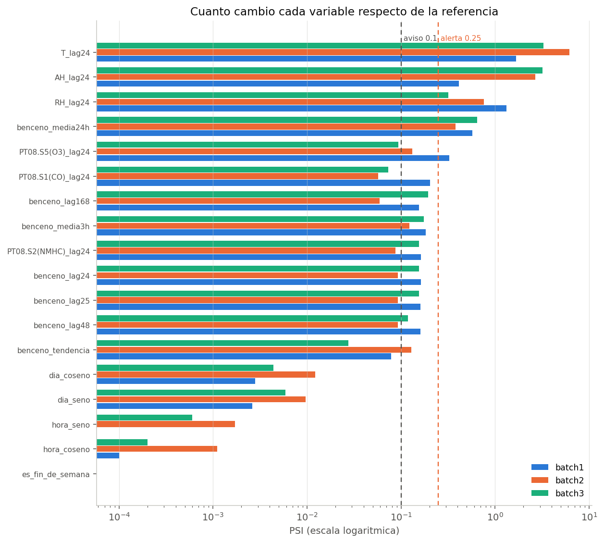
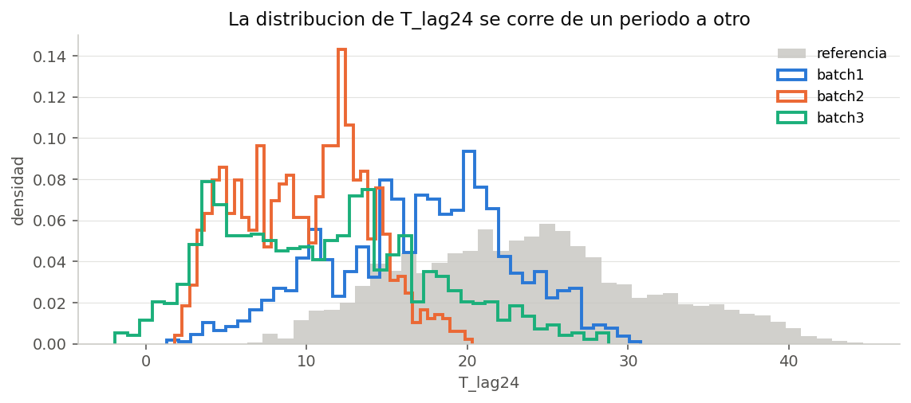
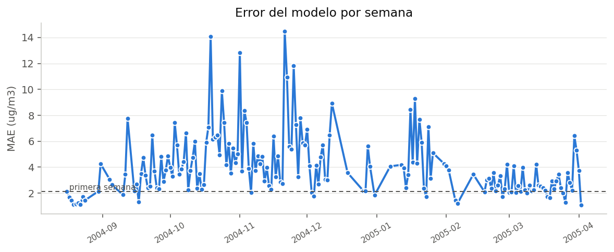
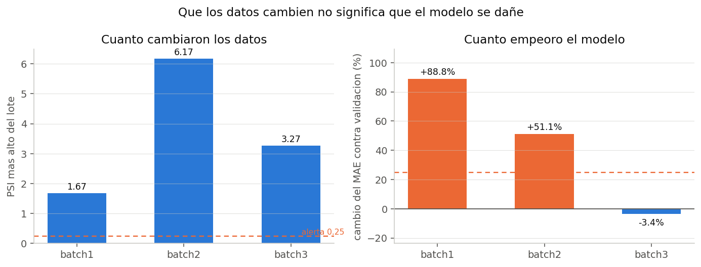

# Reporte de monitoreo

Generado por `python -m src.monitoring.run_monitoring`.

- Modelo: `grupo8-benceno-24h` version 2 (gradient_boosting)
- Referencia: 4219 filas, de 2004-03-16 18:00:00 a 2004-09-30 23:00:00
- Umbrales de PSI: aviso desde 0.1, alerta desde 0.25
- Limite de degradacion: 25% de MAE

## 1. Las tres dimensiones del monitoreo

| Dimension | Que vigila | Donde esta |
|---|---|---|
| System (N1) | latencia, throughput, errores, disponibilidad | `GET /metrics` de la API y `logs/pipeline.log` |
| Data (N2) | que las distribuciones no cambien | este reporte, seccion 2 |
| Model (N3) | que el pronostico siga acertando | este reporte, seccion 3 |

## 2. Cambios en los datos (Data Monitoring)

Se comparan las distribuciones de cada variable en el periodo de
referencia contra cada lote de produccion. Cuatro medidas distintas,
porque cada una mira algo diferente:

- **PSI**: parte la variable en diez tramos y compara los porcentajes. Es la que usamos para decidir.
- **Kolmogorov-Smirnov**: la mayor distancia entre las curvas acumuladas. Ojo con su p-valor: con miles de filas casi todo sale significativo.
- **Wasserstein**: cuanto habria que mover los datos, en las unidades de la variable.
- **Jensen-Shannon**: que tan distintas son, de 0 a 1.

### batch1

- Estado: **ALERT**
- PSI mas alto: 1.671 en `T_lag24`
- Variables en alerta: ['T_lag24', 'RH_lag24', 'benceno_media24h', 'AH_lag24', 'PT08.S5(O3)_lag24']
- Variables en aviso: ['PT08.S1(CO)_lag24', 'benceno_media3h', 'PT08.S2(NMHC)_lag24', 'benceno_lag24', 'benceno_lag25', 'benceno_lag48', 'benceno_lag168']

| variable | psi | estado | ks_estadistico | ks_pvalor | ks_significativo | wasserstein | jensen_shannon | media_referencia | media_produccion |
|---|---|---|---|---|---|---|---|---|---|
| T_lag24 | 1.6712 | ALERT | 0.3867 | 9.66e-146 | True | 6.5369 | 0.4301 | 23.589 | 17.052 |
| RH_lag24 | 1.3163 | ALERT | 0.4647 | 3.66e-213 | True | 17.5268 | 0.4608 | 43.08 | 60.607 |
| benceno_media24h | 0.571 | ALERT | 0.3194 | 1.06e-98 | True | 0.2079 | 0.3902 | 2.206 | 2.398 |
| AH_lag24 | 0.4103 | ALERT | 0.1816 | 8.21e-32 | True | 0.1159 | 0.2863 | 1.181 | 1.206 |
| PT08.S5(O3)_lag24 | 0.3256 | ALERT | 0.2472 | 7.47e-59 | True | 0.2062 | 0.2449 | 6.788 | 6.991 |
| PT08.S1(CO)_lag24 | 0.2044 | WARNING | 0.1915 | 2.44e-35 | True | 0.0767 | 0.2202 | 6.963 | 7.031 |
| benceno_media3h | 0.1826 | WARNING | 0.1791 | 5.95e-31 | True | 0.214 | 0.2161 | 2.208 | 2.396 |
| PT08.S2(NMHC)_lag24 | 0.1631 | WARNING | 0.1678 | 3.27e-27 | True | 0.0907 | 0.1878 | 6.815 | 6.897 |
| benceno_lag24 | 0.163 | WARNING | 0.1675 | 4.33e-27 | True | 0.2113 | 0.1834 | 2.207 | 2.396 |
| benceno_lag25 | 0.1617 | WARNING | 0.1663 | 1.03e-26 | True | 0.2103 | 0.1822 | 2.208 | 2.396 |
| benceno_lag48 | 0.1604 | WARNING | 0.1669 | 6.79e-27 | True | 0.2122 | 0.1847 | 2.213 | 2.402 |
| benceno_lag168 | 0.1546 | WARNING | 0.1575 | 5.37e-24 | True | 0.1799 | 0.179 | 2.222 | 2.375 |
| benceno_tendencia | 0.0782 | OK | 0.0658 | 0.000152 | True | 0.1021 | 0.1125 | -0.007 | -0.006 |
| dia_coseno | 0.0028 | OK | 0.0183 | 0.85 | False | 0.0193 | 0.0192 | 0.012 | 0.03 |
| dia_seno | 0.0026 | OK | 0.0159 | 0.942 | False | 0.0179 | 0.0212 | 0.012 | -0.0 |
| hora_coseno | 0.0001 | OK | 0.0032 | 1.0 | False | 0.0038 | 0.0038 | -0.004 | -0.0 |
| hora_seno | 0.0 | OK | 0.0012 | 1.0 | False | 0.0012 | 0.0018 | 0.001 | -0.0 |
| es_fin_de_semana | 0.0 | OK | 0.0159 | 0.942 | False | 0.0159 | 0.0149 | 0.279 | 0.295 |

### batch2

- Estado: **ALERT**
- PSI mas alto: 6.175 en `T_lag24`
- Variables en alerta: ['T_lag24', 'AH_lag24', 'RH_lag24', 'benceno_media24h']
- Variables en aviso: ['PT08.S5(O3)_lag24', 'benceno_tendencia', 'benceno_media3h']

| variable | psi | estado | ks_estadistico | ks_pvalor | ks_significativo | wasserstein | jensen_shannon | media_referencia | media_produccion |
|---|---|---|---|---|---|---|---|---|---|
| T_lag24 | 6.1748 | ALERT | 0.7843 | 9.2e-322 | True | 13.7536 | 0.7855 | 23.589 | 9.835 |
| AH_lag24 | 2.6701 | ALERT | 0.5068 | 1.6e-199 | True | 0.4625 | 0.5765 | 1.181 | 0.719 |
| RH_lag24 | 0.7644 | ALERT | 0.3416 | 3.29e-88 | True | 14.6777 | 0.3755 | 43.08 | 57.758 |
| benceno_media24h | 0.3808 | ALERT | 0.2271 | 8.99e-39 | True | 0.1779 | 0.2835 | 2.206 | 2.062 |
| PT08.S5(O3)_lag24 | 0.1316 | WARNING | 0.1423 | 2.11e-15 | True | 0.1158 | 0.1764 | 6.788 | 6.887 |
| benceno_tendencia | 0.1279 | WARNING | 0.0893 | 2.57e-06 | True | 0.1443 | 0.1519 | -0.007 | -0.003 |
| benceno_media3h | 0.1222 | WARNING | 0.129 | 9.84e-13 | True | 0.1704 | 0.1699 | 2.208 | 2.049 |
| benceno_lag25 | 0.0925 | OK | 0.1146 | 3.83e-10 | True | 0.1624 | 0.1488 | 2.208 | 2.049 |
| benceno_lag48 | 0.0924 | OK | 0.114 | 4.9e-10 | True | 0.1618 | 0.1519 | 2.213 | 2.054 |
| benceno_lag24 | 0.0922 | OK | 0.1132 | 6.6e-10 | True | 0.1597 | 0.1491 | 2.207 | 2.052 |
| PT08.S2(NMHC)_lag24 | 0.0869 | OK | 0.1135 | 6.02e-10 | True | 0.0639 | 0.145 | 6.815 | 6.753 |
| benceno_lag168 | 0.0593 | OK | 0.0821 | 2.05e-05 | True | 0.0852 | 0.1196 | 2.222 | 2.234 |
| PT08.S1(CO)_lag24 | 0.0573 | OK | 0.0701 | 0.000465 | True | 0.0205 | 0.0875 | 6.963 | 6.978 |
| dia_coseno | 0.0122 | OK | 0.0278 | 0.521 | False | 0.0048 | 0.0092 | 0.012 | 0.014 |
| dia_seno | 0.0097 | OK | 0.0406 | 0.12 | False | 0.062 | 0.0361 | 0.012 | -0.05 |
| hora_seno | 0.0017 | OK | 0.0188 | 0.92 | False | 0.0251 | 0.0157 | 0.001 | 0.026 |
| hora_coseno | 0.0011 | OK | 0.0147 | 0.992 | False | 0.0214 | 0.015 | -0.004 | -0.025 |
| es_fin_de_semana | 0.0 | OK | 0.0232 | 0.74 | False | 0.0232 | 0.0217 | 0.279 | 0.302 |

### batch3

- Estado: **ALERT**
- PSI mas alto: 3.265 en `T_lag24`
- Variables en alerta: ['T_lag24', 'AH_lag24', 'benceno_media24h', 'RH_lag24']
- Variables en aviso: ['benceno_lag168', 'benceno_media3h', 'benceno_lag25', 'benceno_lag24', 'PT08.S2(NMHC)_lag24', 'benceno_lag48']

| variable | psi | estado | ks_estadistico | ks_pvalor | ks_significativo | wasserstein | jensen_shannon | media_referencia | media_produccion |
|---|---|---|---|---|---|---|---|---|---|
| T_lag24 | 3.2653 | ALERT | 0.6098 | 2.53e-321 | True | 12.5677 | 0.648 | 23.589 | 11.021 |
| AH_lag24 | 3.1848 | ALERT | 0.6054 | 2.64e-321 | True | 0.4985 | 0.6197 | 1.181 | 0.683 |
| benceno_media24h | 0.6426 | ALERT | 0.2544 | 5.01e-56 | True | 0.2326 | 0.341 | 2.206 | 1.976 |
| RH_lag24 | 0.3165 | ALERT | 0.1954 | 4.21e-33 | True | 8.4635 | 0.242 | 43.08 | 51.543 |
| benceno_lag168 | 0.1942 | WARNING | 0.186 | 5.45e-30 | True | 0.2976 | 0.2 | 2.222 | 1.924 |
| benceno_media3h | 0.1751 | WARNING | 0.1799 | 4.25e-28 | True | 0.2531 | 0.1793 | 2.208 | 1.955 |
| benceno_lag25 | 0.1561 | WARNING | 0.1747 | 1.72e-26 | True | 0.2534 | 0.1667 | 2.208 | 1.955 |
| benceno_lag24 | 0.1556 | WARNING | 0.1752 | 1.18e-26 | True | 0.2537 | 0.1668 | 2.207 | 1.953 |
| PT08.S2(NMHC)_lag24 | 0.1551 | WARNING | 0.176 | 6.78e-27 | True | 0.1034 | 0.165 | 6.815 | 6.712 |
| benceno_lag48 | 0.1181 | WARNING | 0.152 | 3.83e-20 | True | 0.2236 | 0.1516 | 2.213 | 1.99 |
| PT08.S5(O3)_lag24 | 0.0938 | OK | 0.1081 | 2.16e-10 | True | 0.0895 | 0.1509 | 6.788 | 6.841 |
| PT08.S1(CO)_lag24 | 0.073 | OK | 0.0821 | 3.62e-06 | True | 0.0331 | 0.1099 | 6.963 | 6.996 |
| benceno_tendencia | 0.0275 | OK | 0.0453 | 0.0354 | True | 0.043 | 0.0644 | -0.007 | -0.037 |
| dia_seno | 0.0059 | OK | 0.03 | 0.336 | False | 0.038 | 0.0318 | 0.012 | -0.026 |
| dia_coseno | 0.0044 | OK | 0.021 | 0.77 | False | 0.0357 | 0.022 | 0.012 | 0.048 |
| hora_seno | 0.0006 | OK | 0.0099 | 1.0 | False | 0.0142 | 0.0094 | 0.001 | 0.015 |
| hora_coseno | 0.0002 | OK | 0.0038 | 1.0 | False | 0.0038 | 0.0078 | -0.004 | -0.006 |
| es_fin_de_semana | 0.0 | OK | 0.0239 | 0.62 | False | 0.0239 | 0.0224 | 0.279 | 0.303 |





## 3. Desempeño del modelo (Model Monitoring)

Para un problema de pronostico las metricas que corresponden son MAE y
RMSE seguidas en el tiempo. La columna `degradacion` compara contra el
desempeño en validacion, que es con el que se aprobo el modelo.

| tramo | filas | desde | hasta | mae | rmse | mape | r2 | sesgo | degradacion |
|---|---|---|---|---|---|---|---|---|---|
| validation | 887 | 2004-08-16 00:00:00 | 2004-09-30 23:00:00 | 2.905 | 4.43 | 33.4 | 0.648 | 1.047 | 0.0001 |
| batch1 | 1464 | 2004-10-01 00:00:00 | 2004-11-30 23:00:00 | 5.485 | 7.906 | 53.4 | 0.306 | 3.181 | 0.8883 |
| batch2 | 1058 | 2004-12-01 00:00:00 | 2005-01-31 23:00:00 | 4.389 | 6.119 | 78.7 | 0.297 | 0.619 | 0.511 |
| batch3 | 1270 | 2005-02-01 00:00:00 | 2005-04-03 14:00:00 | 2.805 | 4.003 | 56.6 | 0.59 | -0.29 | -0.0343 |



Una aclaracion que vale para la defensa: esto solo se puede calcular
cuando ya se sabe lo que de verdad paso. Con un horizonte de 24 horas,
el error de un pronostico recien se puede medir un dia despues. Mientras
tanto, lo unico disponible es el monitoreo de datos. Por eso los dos son
necesarios y ninguno reemplaza al otro.

## 4. Drift no es lo mismo que degradacion

Este es el hallazgo mas importante del monitoreo, y responde
directamente la pregunta de la seccion Q del enunciado.

| Lote | PSI maximo | Degradacion del MAE | Decision |
|---|---|---|---|
| batch1 | 1.671 | +88.8% | **REENTRENAR** |
| batch2 | 6.175 | +51.1% | **REENTRENAR** |
| batch3 | 3.265 | -3.4% | **VIGILAR** |



**El lote 3 tiene un drift enorme y el modelo anda mejor que en**
**validacion.** Si el disparador mirara solo el PSI, habriamos
reentrenado un modelo que estaba funcionando bien.

Por que puede pasar:

1. El modelo aprendio la **relacion** entre las variables, no sus valores.
   Si aprendio que con temperatura baja hay menos benceno, un invierno
   frio entra dentro de lo que ya sabe, aunque la distribucion de
   temperatura se haya movido muchisimo.
2. El drift puede estar en variables que al modelo casi no le importan.
3. Y al reves tambien pasa: un modelo se puede degradar sin drift ninguno,
   si cambia la relacion entre las variables y lo que se quiere predecir.
   Eso se llama concept drift y el PSI no lo ve.

## 5. Cuando reentrenar

```
SI   PSI maximo >= 0.25
Y    degradacion del MAE > 25%
Y    el lote trae al menos 200 filas
ENTONCES  reentrenar
```

Las cuatro respuestas posibles:

| Drift | Degradacion | Decision | Por que |
|---|---|---|---|
| si | si | **REENTRENAR** | cambiaron los datos y el modelo lo sufrio |
| si | no | **VIGILAR** | cambiaron los datos pero el modelo aguanta |
| no | si | **REVISAR_DATOS** | algo pasa que el PSI no ve: concept drift, calidad o un periodo raro |
| no | no | **TODO_BIEN** | seguir midiendo |

Decisiones de esta corrida:

- **batch1: REENTRENAR** — los datos cambiaron (PSI 1.671 por encima de 0.25) Y el modelo se degrado (+88.8%, limite 25%)
- **batch2: REENTRENAR** — los datos cambiaron (PSI 6.175 por encima de 0.25) Y el modelo se degrado (+51.1%, limite 25%)
- **batch3: VIGILAR** — los datos cambiaron (PSI 3.265) pero el modelo sigue respondiendo bien (-3.4%). Reentrenar aqui seria botar un modelo que funciona

## 6. Sobre los umbrales

Los cortes del PSI (0.1 y 0.25) son los
que se usan habitualmente desde los modelos de riesgo crediticio. **No son**
**leyes universales**, y el propio enunciado pide no tratarlos como tales.

En nuestro caso separan bien lo que vimos: las variables de calendario
quedan en cero (y tiene que ser asi, la distribucion de horas y dias no
cambia entre periodos), los rezagos del benceno quedan en la zona de aviso,
y las ambientales se van muy por encima de la alerta por el cambio de
estacion.

Que las variables de calendario den PSI cercano a cero es la comprobacion
de que el calculo esta bien hecho: si dieran alto, algo estaria mal.

El limite de degradacion del 25% lo escogimos nosotras. Es un punto de
partida razonable que habria que ajustar viendo cuanto le cuesta al negocio
un error de pronostico.
